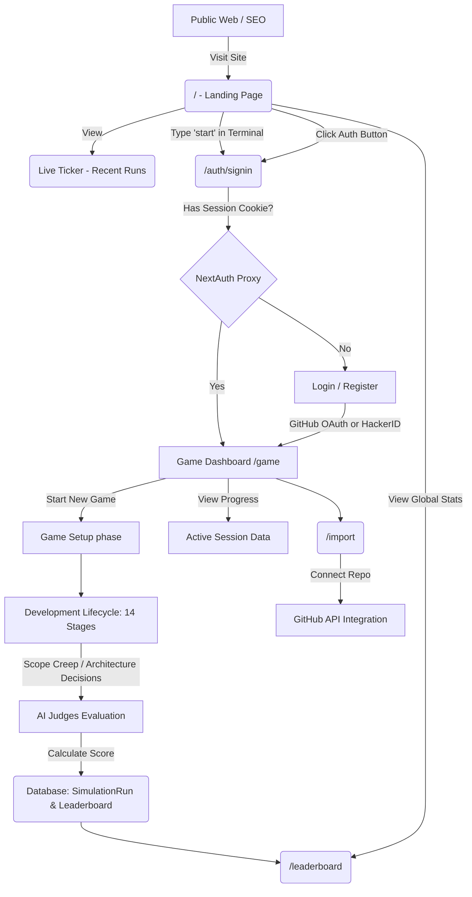

# Hackathon Game - User & Application Flow

This document outlines the end-to-end user journey and architecture flow of the Hackathon Game application.

## Detailed Path Breakdown

### 1. The Entry Point (Landing Page: `/`)
- **Publicly Accessible**: Statically optimized for SEO with OpenGraph and Twitter Cards.
- **Interactive Terminal**: Users can type commands like `help`, `stack`, and `start`. Executing `start` programmatically redirects to the Auth flow.
- **Live Ticker**: A Server Component fetches the latest `Leaderboard` scores from the Prisma database and streams them to the client.

### 2. Authentication Middleware (`proxy.ts`)
- **Route Protection**: The Next.js 16 Proxy intercepts all traffic.
- **Unauthenticated Users**: If a user tries to access `/game`, they are bounced to `/auth/signin`.
- **Authenticated Users**: If an already logged-in user hits `/auth/signin`, they are automatically bounced to `/game`.

### 3. Authentication Page (`/auth/signin`)
- Users can log in or register.
- Uses `NextAuth` with the Prisma Adapter.
- Supports GitHub OAuth linking or custom `Hacker ID` credentials.

### 4. Game Hub (`/game`)
- The central dashboard for an authenticated user.
- Fetches active `GameSession` records linked to the user's ID.
- Allows the user to start a new Hackathon simulation or continue an active one.

### 5. Gameplay Loop (Dynamic Stages)
- The core simulation iterates through the 14 stages defined in the `design.md` schema (e.g., Idea Pitch, Architecture, Crunch Time, Demo).
- Actions trigger Next.js Server Actions which mutate the Prisma `GameSession` database object.

### 6. Leaderboard (`/leaderboard`)
- Public or Private view displaying the highest-scoring simulation runs.
- Driven by the `Leaderboard` database model which aggregates `totalScore` from completed sessions.

## Error Handling Architecture
- **Missing Pages**: Any incorrect URL routes to `app/not-found.tsx` (a custom hacker-themed 404 page).
- **Crashes**: Any runtime errors in production trigger `app/error.tsx` (a React Error Boundary) allowing the user to gracefully reboot the application.
